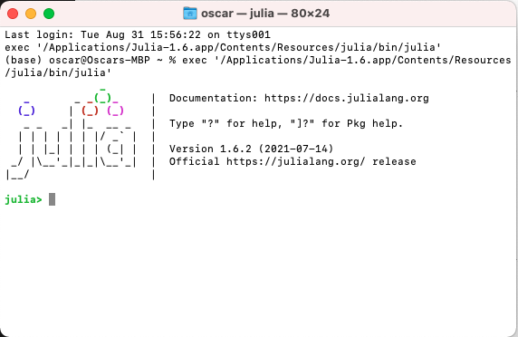
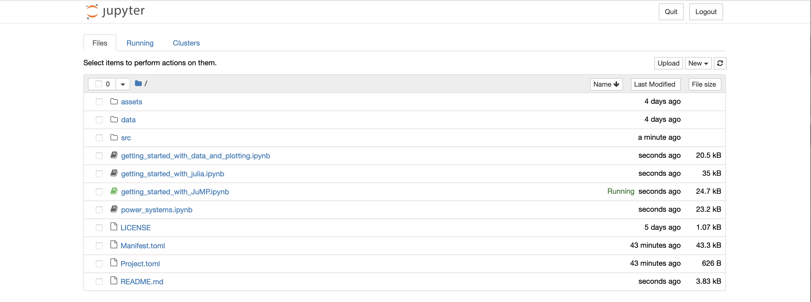
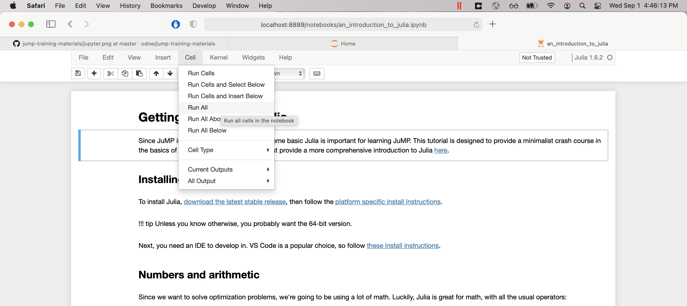

# JuMP training materials

This repository contains introductory materials for learning Julia and JuMP.

This README will walk you through how to install Julia and IJulia.

**If you have trouble installing, please [open a Github issue](https://github.com/odow/jump-training-materials/issues/new).**

## Install Julia

To get started, you first need to install Julia.

 - Download and install the **Current stable release** version of Julia from
   [https://julialang.org/downloads/](https://julialang.org/downloads/).

### Common problems

  - Read the [Platform-specific instructions](https://julialang.org/downloads/platform/#platform_specific_instructions_for_official_binaries)
  - If in doubt, choose the 64-bit version of Julia

## Download these materials

Next, you need to download a copy of these materials.

**If you have `git` installed**

`cd` to an appropriate directory, then run
```
git clone https://github.com/odow/jump-training-materials
```

**If you don't have `git` installed**

[Download this zip file](https://github.com/odow/jump-training-materials/archive/master.zip).
Once downloaded, unzip it to an appropriate location.

## Open Julia

Now open Julia, either by typing `julia` at a terminal, or by launching the icon
from whereever you installed it.

Once open, you should be faced with the Julia *REPL* that looks like this:



## Install the required packages

Now we need to install some packages.
In the Julia REPL, run the following commands:
```julia
cd("/full/path/to/where/you/installed/jump-training-materials")
import Pkg
Pkg.activate(".")
Pkg.instantiate()
Pkg.build("IJulia")
```

**WARNING: it may take a few minutes to download and compile all the packages!**
**The good news is that you only have to run this command once.**

### Common problems

 - On Mac and Linux, `cd("~")` may throw an error instead of `cd`ing to your
   home directory:
   ```julia
   julia> cd("~")
   ERROR: IOError: cd("~"): no such file or directory (ENOENT)
   Stacktrace:
   [1] uv_error
   @ ./libuv.jl:97 [inlined]
   [2] cd(dir::String)
   @ Base.Filesystem ./file.jl:85
   [3] top-level scope
   @ REPL[1]:1
   ```
   To fix, type the full path to the home directory, or type `cd("~`, then press
   the `TAB` key.

## Open a Jupyter notebook

Okay, last step, let's launch a Jupyter notebook! Open a Julia REPL and then
run:
```julia
cd("/full/path/to/where/you/installed/jump-training-materials")
Pkg.activate(".")
using IJulia
IJulia.notebook(dir=".")
```

If all goes well, a browser window will open that looks like this:



To get started on the content portion of the tutorials, click on the first
notebook entitled `an_introduction_to_julia.ipynb`. Then click
"Cell > "Run All".



If things are sucessful, all of the cells should run (some will error on
purpose). You're now ready to follow along with the live training.

**If things don't work, please [open a Github issue](https://github.com/odow/jump-training-materials/issues/new)
with a screenshot of what went wrong.**

### Common problems

 - Don't start Jupyter via Anaconda! There are some version differences that
   cause problems.
